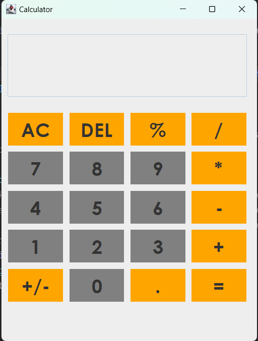

# Java Calculator

## Overview

The Java Calculator is a simple graphical calculator program that provides basic arithmetic operations. It features a user-friendly interface with number buttons, function buttons, and a text field for input and output. This calculator was developed using Java Swing and AWT libraries.

## Features

- Addition, subtraction, multiplication, and division operations.
- Decimal point support for inputting decimal numbers.
- Percentage calculation.
- Change sign (+/-) functionality.
- Clear and delete (DEL) options.
- Responsive and intuitive graphical user interface.

## Preview



## How to Use

1. **Numeric Input**: Click on the numeric buttons (0-9) to input numbers.
2. **Decimal Point**: Use the decimal button (`.`) for decimal numbers.
3. **Basic Operations**: Click on the `+`, `-`, `*`, and `/` buttons to perform basic arithmetic operations.
4. **Percentage**: Calculate the percentage of a number using the `%` button.
5. **Change Sign**: Change the sign of the displayed number with the `+/-` button.
6. **Clear**: Clear the input field with the `AC` button.
7. **Delete**: Remove the last digit with the `DEL` button.
8. **Equals**: Obtain the result of the calculation by clicking the `=` button.

## Implementation Details

- The program is implemented using Java, making use of Swing and AWT libraries for the graphical user interface.
- Object-oriented programming principles are followed, with a clear separation of concerns.
- Event handling is utilized to capture user interactions with buttons.

## How to Run

Ensure you have Java installed on your system. Compile and run the `Calculator.java` file to launch the calculator application.

```bash
javac Calculator.java
java Calculator
```

## Contributions

Contributions are welcome! Feel free to submit issues or pull requests.

## License

This project is licensed under the MIT License - see the LICENSE file for details.
